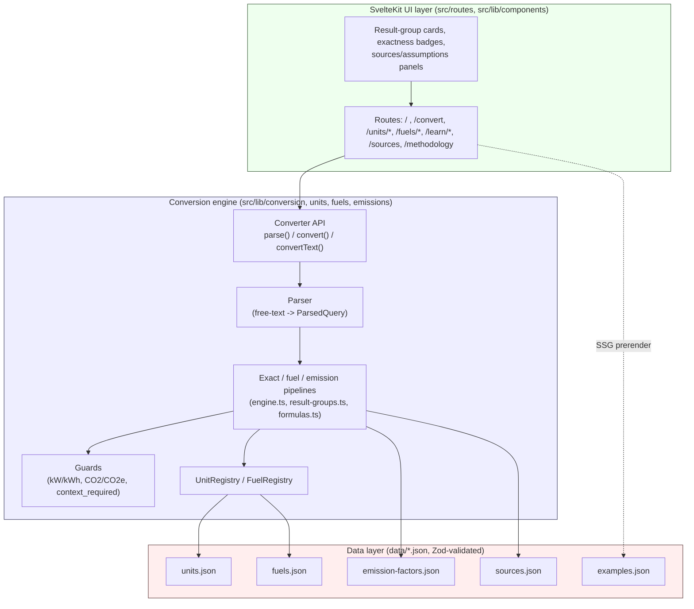
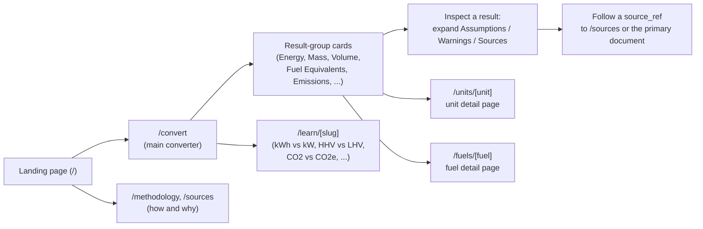

# Architecture — Universal Converter v0.1

> **Audience:** engineers working on any layer of the app.
> **Authority on domain rules:** this document explains *structure and data
> flow*. It does not restate or override the domain rulebook — see
> [`docs/conversion-rules.md`](conversion-rules.md) for the exactness
> taxonomy, dimensional model, and modeling decisions, and
> [`docs/data-model.md`](data-model.md) for the data-file schemas in detail.

---

## 1. System overview

The application is a SvelteKit 2 app with a strict separation between the UI
layer and a framework-independent conversion engine. The engine never imports
Svelte or SvelteKit; the UI only calls the engine's public API and renders
what it returns.



Since 0.2 the app additionally exposes two server routes on top of the same
engine: `/api/convert` (the public JSON API draft — the one **non**-prerendered
route, a Cloudflare Pages Function wrapping the framework-independent handler
in `src/lib/api/convert-endpoint.ts`; see `docs/api.md`) and a prerendered
`/sitemap.xml`. Everything else remains fully prerendered (SSG).

**Layer boundary rule (non-negotiable, `AGENTS.md`):** `src/lib/conversion`,
`src/lib/units`, `src/lib/fuels`, `src/lib/emissions`, and `src/lib/data`
contain no Svelte/SvelteKit imports. Svelte components and SvelteKit routes
only *call* `getConverter()` / `createConverter()` and *render* the returned
`ConversionResultSet` — they never re-implement conversion logic. This keeps
the engine independently testable and reusable (e.g. as a future npm
package or CLI, per the roadmap).

---

## 2. Conversion pipeline flow

A single input goes through parsing, a dimension/context check, one of three
computation paths, and result-group assembly. This is the engine-level view
of the decision flow already specified in
[`docs/conversion-rules.md` §B.4](conversion-rules.md#b4-decision-flow-input--context--result-groups);
it is repeated here as an architecture diagram, not a re-derivation of the
rules.

```mermaid
flowchart TD
    In["Input: value + unit + optional fuel"] --> P{"parseQuery()"}
    P -- parse error --> PErr["ParseError: unknown/ambiguous unit,\nmissing value, suggestions"]
    P -- ok --> Dim{"Dimension-internal\ntarget?"}

    Dim -- yes --> Exact["Exact / standard_definition\nresult groups\n(units/exact-conversions.ts)"]

    Dim -- no, power->energy --> TimeCheck{"Time given?\n(EngineOptions.time)"}
    TimeCheck -- no --> CR1["context_required: [\"time\"]"]
    TimeCheck -- yes --> PowerCalc["E = P * t (exact arithmetic,\nfloored by input exactness)"]

    Dim -- no, fuel needed --> FuelCheck{"Fuel selected?"}
    FuelCheck -- no --> CR2["context_required: [\"fuel\"]"]
    FuelCheck -- yes --> PropCheck{"Needed fuel property\nin data?"}
    PropCheck -- no --> NA["'not available' —\nnever an invented number"]
    PropCheck -- yes --> BasisCheck{"Basis / conditions\nresolved?"}
    BasisCheck -- no --> CR3["context_required or\nlabeled default + warning"]
    BasisCheck -- yes --> FuelCalc["density / heating-value pipeline\n(fuels/density.ts, fuels/heating-values.ts)"]

    Dim -- no, electricity->CO2e --> RegionCheck{"Region + year given?"}
    RegionCheck -- no --> CR4["context_required +\nillustrative examples"]
    RegionCheck -- yes --> EmitCalc["region_year_specific factor\n(emissions/factors.ts)"]

    Exact --> Assemble["ResultSetBuilder:\nassemble result groups\nin canonical order"]
    PowerCalc --> Assemble
    FuelCalc --> Assemble
    EmitCalc --> Assemble
    NA --> Assemble
    CR1 --> Assemble
    CR2 --> Assemble
    CR3 --> Assemble
    CR4 --> Assemble

    Assemble --> Out["ConversionResultSet:\ngroups + assumptions + warnings + source_refs"]
```

Guards enforced at the pipeline level (see `src/lib/conversion/engine.ts` and
`src/lib/conversion/warnings.ts`):

- **No automatic power→energy without a time input** — a bare `1 kW` never
  silently becomes `1 kWh`.
- **No CO2 ↔ CO2e conversion path** — these are separate pseudo-dimensions
  (`emission_mass_co2`, `emission_mass_co2e`); asking for one from the other
  returns `unsupported`, not a derived uplift.
- **`context_required` for missing fuel, region, year, or density** — a
  distinct, non-error state carrying a machine-readable `missing: [...]`
  list so the UI knows exactly which input control to show.
- **Hydrogen combustion CO2 = 0** is shown as an exact physical fact, always
  paired with a "combustion only" label — upstream/production-pathway
  emissions are `context_required`, never implied.
- **Biogenic CO2 reported as its own line**, never folded silently into a
  fossil CO2/CO2e total.
- **No silent averaging of diverging sources** — where sources disagree, the
  chosen source's value is shown with its provenance, or a range, never a
  blended mean.

The full rationale for each of these lives in
[`docs/conversion-rules.md` §C](conversion-rules.md#c-v01-modeling-decisions)
and its pitfall catalog (§D) — this document only maps them to the code that
enforces them.

---

## 3. User flow



The product's honesty commitment (spec §2, §10) means the "inspect" step is
not an optional detail view — every non-exact result is expected to make its
Assumptions/Warnings/Sources meta-groups discoverable in one click (rulebook
§C.8).

---

## 4. Module map (`src/lib`)

| Module | Responsibility |
|---|---|
| `conversion/types.ts` | Single source of truth for all engine types: `Dimension`, `Exactness`, `Unit`, `Fuel`, `EmissionFactor`, `ConversionResult`, `ConversionResultSet`, `Converter`, etc. Re-exported through `src/lib/index.ts`. |
| `conversion/engine.ts` | `createConverter(dataBundle)` — orchestrates parsing, the exact/fuel/emission pipelines, guards, and result-group assembly. |
| `conversion/parser.ts` | Free-text and structured input parsing into a `ParsedQuery` or a structured `ParseError` (unknown unit, ambiguous unit, missing value, etc.). |
| `conversion/result-groups.ts` | `ResultSetBuilder` — assembles `ConversionResult`s into the canonical, ordered `ResultGroup[]` (rulebook §C.8). |
| `conversion/formulas.ts` | Human-readable calculation-path strings (`formula` field) attached to results. |
| `conversion/precision.ts` | `combineExactness` — computes the exactness *floor* of a calculation chain; rounding/sig-fig policy (rulebook §C.7). |
| `conversion/warnings.ts` | Canned, reusable warnings (gas billing, biogenic CO2, hydrogen combustion-only, boe convention, representative-value). |
| `units/registry.ts` | `UnitRegistry` — id/alias/symbol lookup over `data/units.json`. |
| `units/exact-conversions.ts` | Dimension-internal exact arithmetic (`toBaseValue`, `fromBaseValue`, `convertWithinDimension`) using decimal.js. |
| `units/dimensions.ts`, `units/aliases.ts` | Dimension metadata and alias/synonym tables feeding the parser. |
| `fuels/registry.ts` | `FuelRegistry` — id/alias lookup over `data/fuels.json`. |
| `fuels/density.ts` | Volume↔mass bridging (`resolveDensity`, `volumeToMassKg`, `massToVolumeM3`). |
| `fuels/heating-values.ts` | Mass/volume↔energy bridging on a labeled LHV/HHV basis (`pickHeatingValue`, `amountToEnergyJ`, `energyToAmountBase`). |
| `fuels/fuel-types.ts` | Fuel-category predicates (`isElectricity`, `isHydrogen`, etc.) used by the engine's special-case guards. |
| `emissions/factors.ts` | Applies an `EmissionFactor` to a quantity (`applyFactor`, `factorInputKind`). |
| `emissions/scopes.ts` | Human-readable labels for `Scope` and `Pollutant` enums. |
| `emissions/co2-vs-co2e.ts` | Enforces the CO2/CO2e separation at the type/pipeline level. |
| `data/schemas.ts` | Zod schemas for every data file's envelope and entry shape. |
| `data/load-data.ts` | Statically imports and Zod-validates the five JSON data files into a `DataBundle`. |
| `data/validate-data.ts` | Cross-file validation report (dangling `source_refs`, duplicate ids, etc.) beyond per-file Zod shape checks. |
| `formatting/numbers.ts` | Display-time rounding, sig-fig capping, `~` marker, range formatting (rulebook §C.7). |
| `formatting/units.ts` | Canonical display labels for units. |
| `index.ts` | The public `$lib` export surface — the only import path other code (UI, tests, future consumers) should use. |

The UI layer (`src/routes`, `src/lib/components`) is, at the time of writing,
the least-built part of the app (see `docs/roadmap.md` for status) — it
consumes `getConverter()` / `createConverter()` from `src/lib/index.ts` and
renders `ConversionResultSet`s; it must not duplicate engine logic.

---

## 5. The data-file contract

All numeric domain data lives in `data/*.json`, never hard-coded in the UI or
(beyond exact SI constants) in the engine. Every file has a strict envelope
validated by a Zod schema in `src/lib/data/schemas.ts` before the engine ever
sees it (`load-data.ts` fails loudly on a schema violation rather than
letting bad data reach the pipelines).

| File | Envelope | Notes |
|---|---|---|
| `units.json` | `{ $comment, units: Unit[] }` | Exact/standard-definition unit catalog: id, dimension, symbols/names/aliases, `to_base_factor` (decimal string), `is_exact`, `exactness`, `source_refs`. |
| `fuels.json` | `{ $comment, fuels: Fuel[] }` | Fuel catalog: density, heating values (basis-labeled), `emission_factor_ids`, phase, warnings, `source_refs`. |
| `emission-factors.json` | `{ $comment, emission_factors: EmissionFactor[] }` | Pollutant, metric, scope, basis, region, year, `biogenic` flag, `source_id`. |
| `sources.json` | `{ $comment, sources: Source[] }` | id, title, publisher, url, license, reliability — every `source_refs` entry elsewhere must resolve here. |
| `examples.json` | `{ $comment, examples: [...] }` | Quick-example inputs for the UI's "Quick Examples" feature. |

**Contract rules enforced by validation (spec §7, §12, rulebook throughout):**

- Every `fuel_id` / `unit_id` is unique within its file.
- Every `source_id`/`source_refs` entry resolves to an existing `sources.json`
  entry.
- Every non-exact value carries at least one `source_refs` entry — no
  invented numbers.
- Heating values and densities always carry their unit and, where
  applicable, `basis` (`lhv`/`hhv`) — never ambiguous.
- Missing data is represented by the *absence* of an optional field (which
  the UI renders as "not available"), never by a placeholder number.

The exact TypeScript shapes are defined once in `src/lib/conversion/types.ts`
and documented field-by-field in [`docs/data-model.md`](data-model.md) (Data
agent's document — authoritative for schema details; this document only
describes the contract at a system level).
