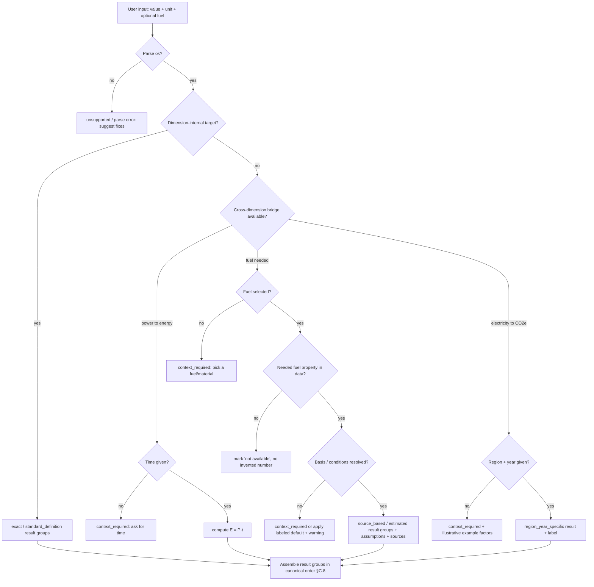

# Conversion Rules — Universal Converter v0.1

> **Status:** Normative domain rulebook for v0.1.
> **Audience:** Data, Engine, and Frontend agents implement *against* this document;
> it also seeds the user-facing Learn / Methodology pages.
> **Authority:** Derived from `docs/spec-v0.1.md` (esp. §2, §3, §7, §8, §9, §10).
> Where this document makes a concrete modeling decision the spec left open, the
> decision and its justification are stated inline and marked **[DECISION]**.
>
> This file defines *how the model must behave*. It does **not** define numeric
> fuel/emission values — those live in `data/*.json` (Data agent) and their
> provenance in `docs/research-notes.md` / `docs/sources.md` (Research agent).
> Where a number appears here it is either an **exact definitional constant**
> (safe to hard-code) or an *illustrative placeholder* explicitly labeled as such.

---

## 0. Reading guide

- **§A — Exactness taxonomy.** The seven (proposed eight) exactness levels, with
  concrete examples. This is the vocabulary every result must speak.
- **§B — Dimensional model.** What dimensions exist and which cross-dimension
  conversions are legal and what each one *requires*.
- **§C — v0.1 modeling decisions.** The eight decisions that make the product
  correct rather than merely plausible. This is the core.
- **§D — Pitfall catalog.** The classic mistakes, and the specific mechanism in
  our model that prevents each one.

A companion document, `docs/accuracy-and-limitations.md`, states honestly what
v0.1 answers exactly, what it estimates, and what it refuses.

---

## A. Conversion taxonomy (exactness levels)

Every `ConversionResult` carries an `exactness` field (spec §7.6). The field is
**not cosmetic**: the Frontend agent renders each level with a distinct visual
treatment (spec §10 requires the UI to distinguish *exact / source-based /
estimate / context required / unsupported*), and the precision policy (§C.7)
keys off it. A result must be assigned the **least exact** level that any of its
inputs or factors demands — exactness is a *floor*, propagated by the weakest
link in the calculation path.

### A.1 The levels

| Level | Meaning | Sig-figs policy (see §C.7) | Prefix marker |
|---|---|---|---|
| `exact` | Conversion follows from an SI or definitional identity. No material assumption, no source needed beyond the definition itself. | Full precision, capped at display N sig figs | — |
| `standard_definition` | Value fixed by a published *standard/convention*, not physics. The number is exact *by fiat* but the entity it stands for is not a natural constant. | Full precision of the defined constant | — |
| `source_based` | A measured/tabulated value taken from a cited source (fuel density, calorific value, emission factor). Correct for the source's stated conditions; varies in reality. | ≤ 3–4 sig figs | — |
| `estimated` | Derived or representative value with real spread; no single authoritative figure (e.g. energy in a physical barrel of crude, energy in "wood"). | ≤ 2–3 sig figs | `~` |
| `region_year_specific` | Correct **only** for a stated region *and* year (grid electricity CO2e above all). Meaningless without that context. | ≤ 2–3 sig figs, always with region+year label | `~` + label |
| `user_assumption` | Result depends on a value the *user* supplied or accepted (a density they typed, a heating-value basis they toggled, a reference condition they chose). | Inherits the assumed value's precision | — |
| `context_required` **[DECISION — new level]** | The conversion is *well-defined in principle* but cannot be computed because a required piece of context is missing. Not an error — a **prompt for input**. | n/a — no number is produced | — |
| `unsupported` | The conversion is not meaningful, not in scope, or dimensionally impossible even in principle. | n/a — no number | — |

### A.2 [DECISION] Why `context_required` is its own level, not folded into `unsupported`

The spec's §7.6 enum lists `unsupported` but not `context_required`; spec §10 and
§8.2/§13.4, however, repeatedly demand a distinct **"context required"** UI state
(e.g. electricity without region/year). **We add `context_required` as an explicit
eighth level.** Justification:

- **Semantics differ fundamentally.** `unsupported` means *"this question has no
  good answer"* (e.g. convert kilograms to seconds). `context_required` means
  *"this question has a good answer once you tell me one more thing"* (e.g. kWh
  of electricity → CO2e, once you pick a region and year; or kW → kWh, once you
  give a duration). Collapsing them would tell a user "unsupported" for a query
  the product is explicitly built to handle.
- **Different UI affordance.** `unsupported` yields an explanation and a dead end.
  `context_required` yields an explanation **plus an input control** (a region/year
  picker, a time field, a density/basis toggle) and, where the Data agent has
  illustrative factors, clearly-labeled example outputs (§C.6).
- **Different downstream contract.** The Engine returns `context_required` with a
  machine-readable `missing: [...]` list (e.g. `["time"]`, `["region","year"]`,
  `["density"]`) so the Frontend knows exactly which control to surface.

The `types.ts` `Exactness` union must therefore be extended to include
`context_required`. This is the one deliberate deviation from the spec's literal
§7.6 enum, made per the spec's own §10 requirement and its "justified deviation"
clause (spec header).

### A.3 Concrete examples per level

- **`exact`** — `1 kWh → 3.6 MJ`; `1 Wh → 3600 J`; `1 barrel → 42 US gallons`;
  `1 tonne → 1000 kg`; `1 h → 3600 s`; `1 L → 0.001 m³`. Also cross-dimension
  when the bridging quantity is user-supplied and treated as exact:
  `2 kW × 3 h → 6 kWh` (the arithmetic is exact; see §C.7 on how the *result*
  exactness is nonetheless bounded by the least-exact input).
- **`standard_definition`** — `1 toe = 41.868 GJ` (IEA/OECD convention);
  `1 tce = 29.3076 GJ`; `1 therm(US) = 105 480 400 J`; `1 cal_IT = 4.1868 J`;
  `1 BTU_IT = 1055.05585262 J`; `1 quad = 10^15 BTU_IT`. The number is exact, but
  it stands for a *conventional* quantity, not a measured property of any real oil
  or coal.
- **`source_based`** — `diesel density = 0.835 kg/L (source X, year Y)`;
  `natural gas NCV = 3X.X MJ/m³ (source)`; `gasoline CO2 factor = 2.3X kg/L
  (source)`. Correct for the source's basis/conditions; genuine real-world spread.
- **`estimated`** — energy content of *one physical barrel of crude oil*
  (crude grade varies); energy in `1 kg wood` (species + moisture); anything the
  Data agent can only give as a representative mid-range figure.
- **`region_year_specific`** — `1 kWh electricity → gCO2e`, valid only for a
  named grid + year; `district heat → CO2e`. Never global, never timeless.
- **`user_assumption`** — the user overrides diesel density with `0.84 kg/L`, or
  toggles the heating-value basis to HHV, or enters gas reference conditions; the
  result's provenance is "your input", not a source.
- **`context_required`** — `1 kWh electricity → CO2e` with no region/year;
  `1 kW → kWh` with no time; `1 m³ gas → kg` with no density/composition chosen
  and no default assumption accepted.
- **`unsupported`** — `1 kg → 1 s`; a fuel we have no data for asked for energy;
  a pollutant/scope combination we do not model.

---

## B. Dimensional model

### B.1 Base dimensions in v0.1

Pure, dimension-internal conversions need **no** material context and are always
`exact` (or `standard_definition` where the unit itself is a convention).

| Dimension | Representative units | Base unit (suggested) |
|---|---|---|
| `energy` | J, kJ, MJ, GJ, TJ, PJ, Wh, kWh, MWh, GWh, TWh, cal, kcal, BTU, kBTU, MMBTU, therm, quad, toe, ktoe, Mtoe, boe, tce | joule (J) |
| `power` | W, kW, MW, GW, TW | watt (W) |
| `mass` | mg, g, kg, tonne (t), lb, short ton, long ton | kilogram (kg) |
| `volume` | mL, L, m³, cm³, ft³, US gallon, imperial gallon, barrel | cubic metre (m³) |
| `time` | s, min, h, day, year | second (s) |

Notes:
- `toe`, `tce`, `boe`, `therm`, `quad` are energy units **by convention**; they
  live in the energy dimension but carry `standard_definition` (or, for the
  *physical* barrel-of-crude energy, `estimated` — see §C.3), never plain `exact`.
- `year` is defined explicitly (see §D "ambiguous year"): v0.1 uses the **Julian
  year = 365.25 days = 31 557 600 s** for unit arithmetic and labels it. It is
  never silently equated to 365 days.

### B.2 Pseudo-dimensions (do not auto-convert to/from the base dimensions)

| Pseudo-dimension | Units | Purpose |
|---|---|---|
| `emission_mass_CO2` | g/kg/t **CO2** | Direct CO2 mass only. |
| `emission_mass_CO2e` | g/kg/t **CO2e** | CO2-equivalent (CO2 + other GHG × GWP). |
| `energy_density_mass` | MJ/kg, kWh/kg | Heating value per mass. |
| `energy_density_volume` | MJ/L, kWh/L, MJ/m³, kWh/m³ | Heating value per volume. |
| `emission_intensity` | gCO2/kWh, kgCO2/GJ, kgCO2/L, kgCO2/kg, gCO2e/kWh, … | Emission per unit of energy/fuel. |

**Hard rule:** `CO2` and `CO2e` are **separate** pseudo-dimensions. There is
**no** conversion path between them — CO2e is not "more CO2", it is a different
metric (§C.5, §D). The engine must refuse `X kg CO2 → Y kg CO2e` and vice versa
as `unsupported`, explaining why.

### B.3 Cross-dimension conversions: the legality matrix

A cross-dimension conversion is legal **only** when the listed bridging input is
present. If it is absent, the engine returns `context_required` with the missing
item(s) named — never a silent default that isn't clearly labeled.

| From → To | Requires | Resulting exactness (floor) | Rule |
|---|---|---|---|
| `power → energy` | a **time** quantity | as inputs (arithmetic exact) | `E = P · t`. **No automatic kW→kWh without a time input** (spec §9.1). |
| `energy → power` | a **time** quantity | as inputs | `P = E / t`. Same rule mirrored. |
| `volume ↔ mass` (fuel) | `density(fuel)` | `source_based` (or `estimated`/`user_assumption`) | `m = V · ρ`. Density is a fuel property from data or user. |
| `volume → energy` (fuel) | `heating_value(fuel, basis)` **and** density if the HV is per-mass | `source_based`/`estimated` | Via MJ/L directly, or via mass then MJ/kg. Basis (LHV/HHV) always labeled. |
| `mass → energy` (fuel) | `heating_value(fuel, basis)` | `source_based`/`estimated` | `E = m · HV_mass`. Basis always labeled. |
| `energy → volume/mass` (fuel) | inverse of the above | same floor | Reverse of the fuel-energy rules. |
| `fuel quantity → CO2 / CO2e` | `emission_factor(fuel, pollutant, basis, scope, region, year)` | `source_based` or `region_year_specific` | See §C.5. Metric + scope + basis + region + year always stated. |
| `electricity (kWh) → CO2e` | `grid_factor(region, year)` | `region_year_specific`, else `context_required` | See §C.6. |
| `m³ natural gas → energy` | `volumetric_energy(gas, ref-conditions, basis)` | `source_based` + mandatory warning | See §C.2. Never presented as an exact identity. |
| any → `boe` / `toe` / `tce` | the standard definition | `standard_definition` | Energy-equivalence units, **not** physical barrels/tonnes (§C.3, §D). |

### B.4 Decision flow (input → context → result groups)

---

## C. v0.1 modeling decisions

### C.1 [DECISION] Heating-value basis default = **LHV / NCV**, always labeled, HHV shown alongside where data exists

**Decision.** The **default basis for displaying fuel energy is the lower heating
value (LHV, a.k.a. net calorific value / NCV).** Every energy result derived from
a fuel is labeled with its basis. Where the Data agent has both, the **HHV/GCV
value is shown alongside** (as a secondary line in the Energy group), never mixed
silently.

**Justification.**
- LHV/NCV is the dominant convention in international energy statistics: IEA/OECD
  energy balances, and the `toe` definition itself (41.868 GJ), are expressed on a
  **net** basis. Europe generally reports and reasons in NCV.
- The main counter-convention is the **US (HHV/GCV)** and — importantly —
  **UK gas billing and DESNZ/DEFRA guidance**, where the *default reporting basis
  is gross (GCV)*: DESNZ tells companies to use Gross CV factors unless they know
  their fuel data is on a Net CV basis. (Note the subtlety: DESNZ's *combined
  emission factors* are published per-GJ on a **net** basis, yet the *energy* a UK
  gas bill states is **gross** — precisely the kind of mismatch this product must
  surface rather than hide.)
- Choosing one default and labeling it, while showing the other where available,
  is the only honest option: silently picking either basis creates a ~5–6% error
  for gas and up to ~10–20% for hydrogen/biomass-rich fuels.

**Rules.**
1. Default basis = LHV/NCV. The chosen basis appears on every fuel-energy result
   (`basis: "LHV"` etc.), never omitted (spec §9.2, AGENTS.md non-negotiable).
2. If a fuel has an HHV/GCV value in data, show it as a labeled secondary figure.
3. The user may toggle the basis; when they do, the result's exactness gains a
   `user_assumption` character on the basis choice (the underlying value stays
   `source_based`).
4. If only one basis is available in data, show that one and state that the other
   is "not available" — do **not** derive HHV from LHV by a generic factor
   (the LHV→HHV gap depends on the fuel's hydrogen/moisture content).

### C.2 [DECISION] Natural gas: normal cubic metre at stated reference conditions, with a displayed assumed volumetric energy content and a mandatory billing warning

**Decision.** In v0.1, **"m³ natural gas" is interpreted as a *normal cubic metre*
(Nm³) at a stated reference condition**, converted to energy using a clearly
displayed **assumed volumetric energy content** taken from the data file (a value
in the ~10–11 kWh/m³ range for typical pipeline gas, on the chosen HV basis).
Every such result carries a **mandatory warning** that real billing depends on the
supplier's Brennwert (calorific value) and Zustandszahl (state/correction number).

**Reference-condition rule.** Gas volume is meaningless without stated temperature
and pressure. v0.1 fixes and *displays* a single reference condition for the
assumed energy content and labels it. The recommended default is the condition
under which the data source's value is quoted; where the source uses the common
**"normal" condition (0 °C, 101.325 kPa)** we label it `Nm³ @ 0 °C, 101.325 kPa`.
If a source instead uses the **"standard" condition (15 °C or 25 °C)** the label
changes accordingly. The engine never assumes the two are interchangeable
(§D "Nm³ vs Sm³ vs m³").

**Assumption text — content requirements (not final copy):**
- States the numeric assumed energy content *and its unit* (e.g. "assumed
  ≈ 10.X kWh per m³").
- Names the **basis** (LHV/NCV or HHV/GCV) explicitly.
- Names the **reference condition** (temperature + pressure) the volume is taken
  at.
- Cites the **source_id** and year of the assumed value.
- Flags that natural gas composition (and hence energy content) **varies by field,
  network, and time**.

**Warning text — content requirements (not final copy):**
- States plainly that **this is not how a gas bill is calculated**.
- Names the two billing-relevant quantities the tool does *not* know: the local
  **calorific value (Brennwert)** and the **state number (Zustandszahl /
  correction factor)** that maps the customer's operating-condition m³ to
  reference-condition energy.
- Directs the user to their **supplier's invoice / meter data** for an exact
  figure, and explicitly says the result must **not** be used for billing disputes
  (cross-reference `accuracy-and-limitations.md`).

**Exactness.** `source_based`, never `exact`. The engine must refuse to present
`1 m³ gas = X kWh` as a fixed identity (§D "1 m³ gas = X kWh false exactness").

### C.3 [DECISION] barrel vs boe vs toe vs tce — four distinct entities

| Entity | Kind | v0.1 value & exactness | Rule |
|---|---|---|---|
| **barrel** | *volume* | `1 barrel = 42 US gallons = 158.987294928 L` — **exact** | A pure volume unit. Convert freely within the volume dimension. Never assume it "contains" any particular energy without a fuel + density + HV. |
| **boe** (barrel of oil equivalent) | *energy* (convention) | **[DECISION] v0.1 adopts boe = 5.8 × 10⁶ BTU_IT ≈ 6.1 GJ** → `1 boe = 6 119 320.395… MJ`; exactness `standard_definition` | This is the US/IRS convention (5.8 MMBTU). We adopt it because it is the most widely cited single value and is what most "boe" figures in oil-and-gas reporting mean. The result **must state** "boe (5.8 MMBTU convention)" and note that other conventions exist (e.g. IEA's ~7.15–7.40 boe per toe implies a slightly different value). |
| **toe** (tonne of oil equivalent) | *energy* (convention) | `1 toe = 41.868 GJ` — `standard_definition` (IEA/OECD) | Fixed by definition, derived historically from a net calorific value of ~10⁷ kcal_IT. Not a property of any real oil. |
| **tce** (tonne of coal equivalent) | *energy* (convention) | `1 tce = 29.3076 GJ` — `standard_definition` | Adopted. `1 toe = 1.428571… tce`. Not a property of any real coal. |

**Critical separation:** the **energy content of one *physical* barrel of crude
oil** is a *different, `estimated`* quantity from `boe`. A physical barrel's energy
depends on crude grade/API gravity and is a representative estimate (~5.6–6.3 GJ
range depending on grade); `boe` is a fixed 6.1 GJ *by convention*. The engine must
never present a physical-barrel-of-crude energy figure as `boe`, and must never
present `boe` as if it were the measured energy of the specific oil in question
(§D "boe as physical barrel").

### C.4 [DECISION] Calorie and BTU definitions

| Unit token | v0.1 meaning | Value | Exactness |
|---|---|---|---|
| `cal`, `kcal` | **International Table (IT) calorie** | `1 cal_IT = 4.1868 J`; `1 kcal = 4186.8 J` | `standard_definition` |
| `Cal`, `food Calorie`, `dietary calorie` | **alias → kcal** (IT) | `1 Cal = 1 kcal = 4186.8 J` | `standard_definition` |
| `BTU`, `kBTU`, `MMBTU` | **International Table BTU** | `1 BTU_IT = 1055.05585262 J`; `1 MMBTU = 10⁶ BTU_IT` | `standard_definition` |
| `therm` | **therm (US)** = 100 000 BTU_IT | `1 therm = 1.0550559 × 10⁸ J` (i.e. `10⁵ × 1055.05585262`) | `standard_definition` |
| `quad` | `10¹⁵ BTU_IT` | — | `standard_definition` |

**Justification.**
- **IT calorie (4.1868 J)** over thermochemical (4.184 J): the IT calorie is the
  steam-table/engineering convention and pairs consistently with the IT BTU and
  the `therm`. The two differ by ~0.07%; picking one and labeling it avoids
  incoherent mixed factors. (Spec §13.1 explicitly says "1 kcal ≈ 4184 J depending
  on calorie basis" — we resolve the ambiguity to IT = 4186.8 J and label it.)
- **IT BTU (1055.05585262 J)** over thermochemical BTU (1054.35 J): same coherence
  argument; the IT BTU is the standard general-engineering value and underpins the
  `therm` and `quad`.
- **`therm` = US therm (based on BTU_IT).** We adopt the US therm because the tool
  leans to internationally-recognized SI-coherent conventions and the US therm is
  the legal unit of the US gas industry; the EC therm differs only at the ~10⁻⁵
  level. The choice is labeled on the unit's detail page.

**Alias rule.** "food calorie", "Calorie" (capital C), "dietary calorie",
"nutritional calorie" all resolve to **kcal**. The parser records that an alias was
used so the UI can gently confirm ("interpreting 'Calorie' as kcal").

### C.5 [DECISION] CO2 vs CO2e — never conflated; biogenic CO2 separate; hydrogen combustion = 0

**Core rule.** A result that reports greenhouse gas mass **must** state, together:
1. the **pollutant/metric** — `CO2` *or* `CO2e` (and, where data allows, the
   component gases CH4/N2O), and for CO2e the **GWP set** used (e.g. IPCC AR5/AR6,
   100-yr) if the source states it;
2. the **scope / system boundary** — `direct_combustion`, `scope_1`, `scope_2`,
   `scope_3_upstream`, `well_to_tank`, `tank_to_wheel`, `well_to_wheel`, or
   `unknown_or_mixed` (only ever shown *explicitly* marked);
3. the **basis** — LHV/NCV or HHV/GCV of the underlying energy, since per-energy
   factors depend on it;
4. the **region** and **year** of the factor.

CO2 and CO2e are **separate pseudo-dimensions** (§B.2). There is **no** engine path
that turns one into the other. If a source gives only CO2, the result shows CO2 and
marks CO2e "not available" — it does **not** invent an uplift.

**Biogenic CO2 (wood, wood pellets, ethanol, biodiesel, biogas, the biogenic
fraction of mixed fuels).** Biogenic combustion CO2 is **reported separately**,
in its own line labeled *"biogenic CO2 — reported outside the main scopes"*, and is
**never silently set to zero** inside a fossil-CO2 figure. Rationale: standard GHG
inventory practice (IPCC, GHG Protocol) memo-items biogenic CO2 separately from the
fossil total rather than counting it in Scope 1; but showing a blank "0" would be
misleading (the carbon *is* emitted at the stack — the argument is about the
biological carbon cycle, not about zero physical emission). So v0.1:
- shows the **fossil** CO2/CO2e as the headline emission figure;
- shows **biogenic CO2** as a distinct, explained line, not folded into the total;
- links to a Learn note on why biogenic carbon is accounted separately.

**Hydrogen.** Direct combustion of H₂ produces **CO2 = 0** — this is a genuine
`exact`/physical fact (the molecule contains no carbon), and it is shown *with an
explanation*, not as a suspicious bare zero. Crucially, **upstream emissions of
hydrogen are ≠ 0 and depend entirely on the production pathway** (grey/SMR vs
blue vs green). v0.1 does **not** silently attach any upstream number: upstream
H₂ emissions are `context_required` (production pathway + region/year needed) and
only shown if the Data agent has a cited pathway-specific factor. The zero-combustion
line must sit next to an explicit "combustion only — upstream not included" label so
no user reads "hydrogen = 0 CO2" as a lifecycle claim (§D "hydrogen zero").

### C.6 [DECISION] Electricity kWh → CO2e is `region_year_specific`; default response is `context_required` with clearly-labeled illustrative examples

**Decision.** With **no** region and year, `kWh electricity → CO2e` returns
**`context_required`**, not a number and not `unsupported`. The result:
- explains that grid carbon intensity depends on **country/region, year, and even
  time of day**, so no single global factor is correct (spec §9.6, §11);
- surfaces a **region + year picker** (the machine-readable `missing:
  ["region","year"]`);
- **if** the Data agent has provided illustrative factors, shows **one or more
  clearly-labeled *example* outputs** — each tagged `illustrative example — not a
  default`, with its region, year, and source. These examples are visually
  separated from computed results and never copyable as if authoritative.

When region + year *are* supplied and a cited factor exists, the result is a normal
`region_year_specific` value carrying that region+year label and source.

**How it appears in results (contract for the Frontend):**
- Group header: *"Emissions — context required"*.
- Body: short explanation + region/year control.
- Optional sub-block: *"Illustrative examples"* listing (region, year, gCO2e/kWh,
  source) rows, each explicitly labeled illustrative.
- No headline emission number is emitted at the top level while context is missing.

### C.7 [DECISION] Rounding, precision, and uncertainty policy

Precision is **bounded by exactness** — showing 6 significant figures for an
estimate is itself a domain error (spec §17 criterion 25: "no false precision").
The engine computes internally in full precision (decimal.js) and only **rounds at
display time**, per this table:

| Exactness | Max significant figures (display) | Marker | Uncertainty representation |
|---|---|---|---|
| `exact` | up to N (config, default 6) | none | none needed |
| `standard_definition` | up to N (the constant's own precision) | none | none needed |
| `source_based` | **3–4** | none | optional ± or range if the source gives one |
| `estimated` | **2–3** | leading `~` | range preferred: `~A–B unit` |
| `region_year_specific` | **2–3** | leading `~` + region/year | range if source gives one |
| `user_assumption` | inherit the assumed value's precision | none | propagate user's stated uncertainty if any |

**Rules.**
1. Never display more sig figs than the *least* precise input to the calculation
   allows. A chain `source_based × exact` is `source_based` (3–4 sig figs).
2. **Ranges over point estimates** where a fuel property genuinely spans a range
   (crude energy, wood energy, coal grade): show `~A–B`, and if a single number is
   needed use a representative mid value marked `~`.
3. The `~` prefix is reserved for `estimated` / `region_year_specific`; it must
   **not** appear on `exact`/`standard_definition` results (that would imply false
   doubt), nor be omitted on estimates (that would imply false precision).
4. Trailing zeros are significant: `3.60 MJ` (exact, could show `3.60000`) vs
   `~35 MJ/m³` (estimate) communicate different confidence — the formatter must
   respect the sig-fig cap rather than pad.
5. Rounding mode: round-half-to-even at display; never round *up* an uncertainty
   bound inward (round outward so the stated range never understates spread).

### C.8 [DECISION] Result groups per input type

Result groups appear in a **canonical order** (spec §8.3); only groups that are
*meaningful* for the input are shown. Order is fixed so users learn the layout.

**Canonical group order:**
`Energy → Power → Mass → Volume → Fuel Equivalents → Emissions →
Energy Density → Industrial Units → Assumptions → Warnings → Sources →
Formula / Calculation Path`.

`Assumptions`, `Warnings`, `Sources`, and `Formula` are **meta-groups**: they
appear (collapsible, per spec §10) whenever the result used any assumption, carried
any warning, cited any source, or performed any non-trivial calculation.

| Input type | Result groups shown (in canonical order) |
|---|---|
| **Pure energy unit** (`1 kWh`, `1 MJ`, `1 toe`, `1 boe`) | Energy; Fuel Equivalents (toe/boe/tce, labeled convention); Industrial Units (therm, quad, MMBTU); + Formula. No Mass/Volume/Emissions (no fuel context). |
| **Power** (`1 kW`) | Power; then **context_required** prompt for time to reach Energy (spec §9.1); + Formula. Energy group appears only once a time is given. |
| **Mass** (`1 kg`, `1 tonne`, no fuel) | Mass; + Formula. (Volume/Energy/Emissions require a fuel → offered as context_required "pick a material".) |
| **Volume** (`1 L`, no fuel) | Volume; + Formula. (Mass/Energy/Emissions require a fuel → context_required.) |
| **Fuel + volume** (`1 L diesel`, `1 m³ natural gas`) | Volume; Mass (via density); Energy (via HV, basis-labeled); Fuel Equivalents; Emissions (factor-based or context_required); Energy Density; Assumptions; Warnings; Sources; Formula. |
| **Fuel + mass** (`1 kg hydrogen`, `1 kg wood pellets`, `1 kg hard coal`) | Mass; Volume (via density, where meaningful); Energy (HV, basis-labeled); Fuel Equivalents; Emissions; Energy Density; Assumptions; Warnings; Sources; Formula. |
| **Fuel + energy** (`1 kWh diesel-equivalent`, `1 GJ natural gas`) | Energy; Mass & Volume of that fuel (inverse via HV + density); Emissions; Energy Density; Assumptions; Warnings; Sources; Formula. |
| **Electricity** (`1 kWh electricity`) | Energy; **Emissions — context_required** (region/year picker + illustrative examples, §C.6); Formula. |

---

## D. Pitfall catalog

Each entry: **what goes wrong**, and **how our model prevents it**.

### D.1 kW vs kWh (power vs energy)
- **Wrong:** treating `1 kW` as `1 kWh`, or auto-converting power to energy.
- **Prevented by:** power↔energy is a cross-dimension bridge requiring an explicit
  **time** input (§B.3). Without it the engine returns `context_required:
  ["time"]` and a time field — **never** a silent kW→kWh (spec §9.1, §17.26).

### D.2 HHV/GCV vs LHV/NCV mix-up
- **Wrong:** quoting a gas/hydrogen/biomass energy on one basis while the user
  assumes the other (a 5–20% swing), or deriving HHV from LHV by a generic factor.
- **Prevented by:** every fuel-energy result **labels its basis** (§C.1); default
  = LHV/NCV; HHV shown alongside only from real data, never derived generically;
  basis is a first-class field on data entries and results (AGENTS.md).

### D.3 Nm³ vs Sm³ vs actual m³ (gas reference conditions)
- **Wrong:** treating a "normal" m³ (0 °C), a "standard" m³ (15/25 °C), and the
  customer's operating-condition m³ as the same volume.
- **Prevented by:** gas volumes carry an explicit **reference condition label**
  (§C.2); the energy assumption states the condition; a warning names the
  **Zustandszahl** that separates operating-condition volume from reference energy.

### D.4 barrel vs boe
- **Wrong:** treating the energy-equivalence unit **boe** as a physical 42-gallon
  barrel, or vice versa.
- **Prevented by:** `barrel` is a `volume` unit; `boe` is a `standard_definition`
  energy unit (§C.3). They live in different dimensions; converting between them
  requires a fuel + HV, and the boe label always states its convention.

### D.5 boe as the physical energy of *this* oil
- **Wrong:** reporting a specific crude's energy as exactly `boe`, or `boe` as the
  measured energy of a real barrel.
- **Prevented by:** physical-barrel-of-crude energy is `estimated` with a range
  and is a **separate** quantity from the fixed-by-convention `boe` (§C.3).

### D.6 CO2 vs CO2e
- **Wrong:** presenting a CO2 figure as CO2e (or summing them), or inventing a
  CO2→CO2e uplift.
- **Prevented by:** CO2 and CO2e are separate pseudo-dimensions with **no**
  conversion path (§B.2, §C.5); every emission result states metric + scope +
  basis + region + year; missing CO2e is "not available", never derived.

### D.7 Food calorie confusion
- **Wrong:** conflating `cal` (4.1868 J) with the dietary **Calorie** (= kcal =
  4186.8 J) — a factor-1000 error.
- **Prevented by:** `Cal`/"food calorie"/"dietary calorie" **alias to kcal**
  (§C.4); the parser confirms the interpretation in the UI.

### D.8 Thermochemical vs IT calorie / BTU
- **Wrong:** silently mixing 4.184 J and 4.1868 J calories (or 1054.35 vs
  1055.056 J BTUs), producing incoherent chained factors.
- **Prevented by:** v0.1 fixes **IT** definitions for both (§C.4), labels them on
  the unit detail pages, and uses them consistently so `cal`, `BTU`, `therm`,
  `quad` all cohere.

### D.9 tonne vs short ton vs long ton
- **Wrong:** treating "ton" as unambiguous (metric tonne 1000 kg ≈ 2204.6 lb;
  US short ton 2000 lb ≈ 907.2 kg; UK long ton 2240 lb ≈ 1016.0 kg).
- **Prevented by:** three distinct mass units with distinct ids/aliases; the bare
  token "ton" is treated as **ambiguous** and the parser asks which one (or a
  documented default of *metric tonne* with a visible label), never a silent pick.

### D.10 US gallon vs imperial gallon
- **Wrong:** using one gallon for the other (US gal ≈ 3.785 L; imperial gal ≈
  4.546 L — a ~20% error), which also poisons barrel and fuel-volume results.
- **Prevented by:** separate `us_gallon` and `imperial_gallon` units; `barrel`
  is defined via **US** gallons explicitly (§C.3); the bare token "gallon" is
  ambiguous → parser disambiguates (default US, labeled).

### D.11 "1 m³ gas = X kWh" false exactness
- **Wrong:** presenting a single gas volumetric energy as a fixed identity.
- **Prevented by:** gas energy is `source_based` with a displayed assumption and a
  **mandatory billing warning** (§C.2); the engine refuses to render it as an
  exact identity (§C.7 rule 3).

### D.12 LNG volume vs gas volume
- **Wrong:** equating one m³ of **liquefied** natural gas with one m³ of gaseous
  natural gas (LNG is ~600× denser in energy per volume; ~1 m³ LNG ≈ ~600 m³ gas).
- **Prevented by:** LNG and natural gas are **distinct fuels** in the catalog with
  their own densities and energy densities; the engine never converts LNG volume ↔
  gas volume without going through mass/energy, and results state which phase is
  meant. A warning flags the phase distinction.

### D.13 Ambiguous "year" (and other time units)
- **Wrong:** silently using 365 vs 365.25 vs 360 days for "year" in power↔energy
  arithmetic.
- **Prevented by:** `year` is defined as the **Julian year (365.25 d = 31 557 600
  s)** and labeled (§B.1); the value is documented so results are reproducible.

### D.14 Biogenic CO2 silently zeroed
- **Wrong:** reporting wood/ethanol/biogas as "0 CO2" with no explanation.
- **Prevented by:** biogenic CO2 is a **separate, explained line**, never folded
  as zero into the fossil total (§C.5).

### D.15 Hydrogen "zero emissions" overclaim
- **Wrong:** reading `H₂ combustion CO2 = 0` as a lifecycle/upstream zero.
- **Prevented by:** the zero is labeled **"combustion only"**; upstream is
  `context_required` (pathway + region/year) and shown only from cited data (§C.5).

### D.16 Averaging diverging sources
- **Wrong:** silently averaging two sources that disagree on a fuel property.
- **Prevented by:** no silent averaging (AGENTS.md); show the chosen source's
  value with provenance, or a **range** across sources, with the divergence
  visible (§C.7 rule 2).

### D.17 Deriving one basis/metric from another
- **Wrong:** computing HHV from LHV, CO2e from CO2, or a physical-barrel energy
  from boe, via a generic multiplier.
- **Prevented by:** each such quantity is independent; missing values are marked
  **"not available"** rather than derived (§C.1 rule 4, §C.5, §C.3).

---

## Cross-references

- Numeric fuel/emission values and their sources: `data/*.json`,
  `docs/sources.md`, `docs/research-notes.md` (owned by Data / Research agents).
- Honest scope of exactness, per-fuel variability, and refusals:
  `docs/accuracy-and-limitations.md`.
- Data model / type definitions: `docs/data-model.md`, `src/lib/conversion/types.ts`.
