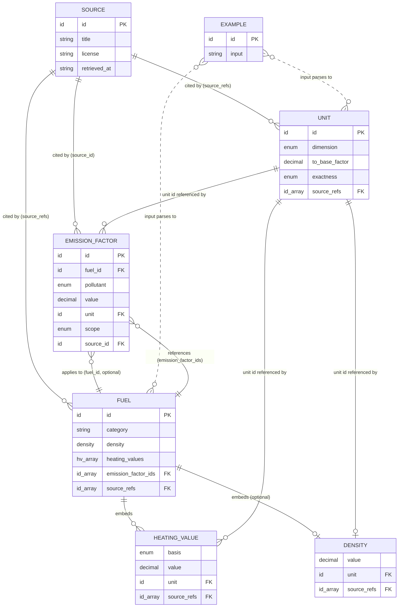

# Data Model — Universal Converter v0.1

> **Owner:** Data agent. **Authority:** implements `docs/spec-v0.1.md` §7, the
> binding modeling decisions in `docs/conversion-rules.md` §C, and the engine data
> contract. The normative schema is `src/lib/data/schemas.ts` (Zod, `.strict()`);
> this document explains it. Every numeric value's provenance lives in
> `docs/research-notes.md` and its source entry in `data/sources.json`.

This document describes the five versioned data files under `data/`, the entities
they hold, the field semantics, the id and provenance conventions, the entity
relationships (with a Mermaid diagram), and a per-fuel coverage matrix showing
which fields are populated and which are honestly **not available**.

---

## 1. Files and envelopes

The catalog is five JSON files, each a strict envelope validated by Zod:

| File | Envelope | Entity | Count (v0.1) |
|---|---|---|---|
| `data/units.json` | `{ $comment?, units: [...] }` | `Unit` | 73 |
| `data/fuels.json` | `{ $comment?, fuels: [...] }` | `Fuel` | 21 |
| `data/emission-factors.json` | `{ $comment?, emission_factors: [...] }` | `EmissionFactor` | 33 |
| `data/sources.json` | `{ $comment?, sources: [...] }` | `Source` | 10 |
| `data/examples.json` | `{ $comment?, examples: [...] }` | `Example` | 20 |

`$comment` is an optional human-readable header. All other keys are rejected
(`.strict()`), so a typo fails loudly at load time (`src/lib/data/load-data.ts`)
rather than silently.

**Numeric fields** accept a JSON number OR a decimal string; strings are preferred
so exact source values survive JSON without a lossy float step (the schema
normalises every numeric field to a validated decimal string for `decimal.js`).

---

## 2. Entities and field semantics

### 2.1 Unit (`data/units.json`)

A pure unit definition. Dimension-internal conversions use `to_base_factor`
(multiply a value by it to reach the dimension's base unit: energy→J, power→W,
mass→kg, volume→m³, time→s). Pseudo-dimension units (emission mass/intensity,
energy density, **mass density**) exist for display/registry and carry a nominal
`to_base_factor` — the engine never bridges dimensions through them.

| Field | Type | Semantics |
|---|---|---|
| `id` | id | Stable kebab/snake-case key (`^[a-z0-9][a-z0-9_-]*$`). |
| `dimension` | enum | One of the base or pseudo dimensions (§4). |
| `symbols` | string[] ≥1 | Case-**sensitive** display symbols; first is canonical. |
| `names` | string[] ≥1 | Case-insensitive human names; first is canonical. |
| `aliases` | string[] | Generous parse aliases (case-insensitive). |
| `to_base_factor` | decimal | Exact factor to the dimension base unit. |
| `is_exact` | bool | True when the factor is an exact SI/definitional identity. |
| `exactness` | enum | `exact` \| `standard_definition` \| … (§4). Drives result labeling. |
| `system` | string? | `SI`, `US`, `imperial`, `convention`, `display`. |
| `notes` | string? | Definition detail, caveats. |
| `source_refs` | id[] | Source ids; **required (≥1) for any non-`exact` unit**. |

### 2.2 Fuel (`data/fuels.json`)

A material whose volume/mass/energy/emissions relationships require context. Never
invents a missing property — an absent field renders as "not available".

| Field | Type | Semantics |
|---|---|---|
| `id` | id | Stable key, e.g. `wood-pellets`. |
| `names` | string[] ≥1 | Canonical + display names. |
| `aliases` | string[] | Rich EN+DE aliases (`benzin`, `erdgas`, `holzpellets`, `gas oil`, …). |
| `category` | string | `oil` \| `gas` \| `coal` \| `biomass` \| `biofuel` \| `hydrogen` \| `electricity`. Routes engine behavior (hydrogen→CO2=0, electricity→context_required). |
| `density` | Density? | Mass per volume (§2.2.1). Omitted when not sourced. |
| `heating_values` | HeatingValue[] | Calorific values, each basis-labeled (§2.2.2). |
| `emission_factor_ids` | id[] | Ids into `emission-factors.json` that apply. |
| `phase` | enum? | `gas` \| `liquid` \| `solid` (LNG vs gas distinction). |
| `typical_ranges` | string? | Free-text spread note (crude grade, coal rank). |
| `source_refs` | id[] | Fuel-level sources. |
| `notes` | string? | Modeling notes, alternative variants, cross-source figures. |
| `warnings` | string[] | Surfaced on every result for this fuel (gas billing, biogenic, aviation multiplier). |

#### 2.2.1 Density (embedded)

| Field | Type | Semantics |
|---|---|---|
| `value` | decimal | Numeric density. |
| `unit` | id | `kg_per_l` \| `kg_per_m3` \| `g_per_cm3` (must resolve in `units.json`). |
| `range` | {low,high}? | Optional spread. |
| `reference_conditions` | string? | e.g. `15 °C`, `liquid phase (pressurised)`. |
| `source_refs` | id[] ≥1 | **Required.** |
| `notes` | string? | Source cell reference. |

#### 2.2.2 HeatingValue (embedded)

| Field | Type | Semantics |
|---|---|---|
| `basis` | enum | `lhv` (net/NCV) or `hhv` (gross/GCV) — **always present** (rulebook §C.1). |
| `value` | decimal | Numeric calorific value. |
| `unit` | id | `mj_per_kg` \| `kwh_per_kg` \| `mj_per_l` \| `kwh_per_l` \| `mj_per_m3` \| `kwh_per_m3`. |
| `range` | {low,high}? | Optional spread (wide for wood/lignite). |
| `source_refs` | id[] ≥1 | **Required.** |
| `notes` | string? | Original unit/basis, derivation note. |

> **Unit note:** DESNZ publishes gravimetric energy as **GJ/tonne**, which is
> numerically identical to **MJ/kg** (1 GJ/tonne = 1 MJ/kg). Those values are
> stored as `mj_per_kg` verbatim with the GJ/tonne origin recorded in `notes` — no
> silent unit conversion. Where a value is genuinely derived (e.g. natural-gas and
> LNG per-litre/per-m³ figures = DESNZ density × DESNZ gravimetric CV, because
> DESNZ's own volumetric cell is too coarsely rounded), the derivation is stated
> explicitly in `notes`.

### 2.3 EmissionFactor (`data/emission-factors.json`)

A cited GHG factor. **CO2 and CO2e are always separate entries** — CO2e is never
derived from CO2 or vice versa (rulebook §C.5, §D.6). Biogenic CO2 is its own
pollutant, routed to a separate result line, never silently zeroed.

| Field | Type | Semantics |
|---|---|---|
| `id` | id | Stable key, e.g. `diesel-co2e-desnz`. |
| `fuel_id` | id? | Fuel this applies to (omitted for grid-electricity factors). |
| `pollutant` | enum | `CO2` \| `CH4` \| `N2O` \| `CO2e` \| `biogenic_CO2`. |
| `metric` | string | What the value measures: `mass_per_volume`, `mass_per_mass`, `mass_per_energy`, `intensity_per_energy`. |
| `value` | decimal | The factor. |
| `unit` | id | `kg_co2_per_l/_m3/_kg/_gj`, `kg_co2e_per_l/_m3/_kg`, `g_co2_per_kwh`, `g_co2e_per_kwh`. |
| `basis` | enum? | `lhv`/`hhv` where the factor is per-energy. |
| `scope` | enum | `direct_combustion`, `scope_1/2`, `scope_3_upstream`, `well_to_tank/wheel`, `tank_to_wheel`, `unknown_or_mixed`. |
| `region` | string? | `UK`, `EU-27`, `global`, … Presence makes the result `region_year_specific`. |
| `year` | int? | Data year. |
| `biogenic` | bool? | `true` routes to the separate biogenic line. |
| `uncertainty` | string? | Range / CI / caveat. |
| `source_id` | id | **Required**, single source. |
| `source_table_or_page` | string? | Exact sheet/table/row reference. |
| `notes` | string? | The gas split, GWP set, derivation, cross-checks. |

### 2.4 Source (`data/sources.json`)

Provenance for every non-exact value.

| Field | Type | Semantics |
|---|---|---|
| `id` | id | e.g. `uk-desnz-ghg-2025`. |
| `title` | string | Full publication title. |
| `publisher` | string? | Issuing body. |
| `url` | url? | Landing page / file URL. |
| `retrieved_at` | string? | Fetch date (`2026-07-04` for this pass). |
| `publication_year` | int? | Data/publication year. |
| `license` | string? | Reuse terms (OGL v3.0, public domain, CC BY 4.0, …). |
| `type` | string? | `government`, `standards-body`, `international-organization`, `government-lab`, `internal-document`. |
| `reliability` | string? | Honest reliability assessment. |
| `notes` | string? | File URLs, sheet names, caveats. |

### 2.5 Example (`data/examples.json`)

Quick-start inputs for the UI. Each must parse cleanly (guarded by
`tests/examples.test.ts`).

| Field | Type | Semantics |
|---|---|---|
| `id` | id | Stable key. |
| `input` | string | Free-text query, e.g. `1 L diesel`. |
| `label` | string? | Display label. |
| `category` | string? | UI grouping (`energy`, `fuel`, `fuel_equivalents`). |
| `notes` | string? | What the example demonstrates. |

---

## 3. Entity relationships

**Referential integrity** (enforced by `src/lib/data/validate-data.ts`, asserted by
`tests/data-validation.test.ts`):

- ids are unique within each catalog.
- every `source_ref` / `source_id` resolves to a `sources.json` entry.
- every `density.unit` / `heating_values[].unit` / `emission_factor.unit` resolves
  to a `units.json` entry.
- every `fuel.emission_factor_ids[]` resolves to an emission factor; every
  `emission_factor.fuel_id` (when set) resolves to a fuel.
- every non-`exact`/`standard_definition` unit has ≥1 `source_ref`.
- every heating value carries a `basis` and ≥1 `source_ref`.

---

## 4. Conventions

### 4.1 ids

Lowercase kebab/snake-case matching `^[a-z0-9][a-z0-9_-]*$`. Fuels use kebab-case
(`wood-pellets`); units use snake-case (`kilowatt_hour`); factor ids encode
fuel + pollutant + source (`diesel-co2e-desnz`, `wood-pellets-biogenic-co2-desnz`).

### 4.2 Dimensions

| Kind | Dimensions |
|---|---|
| **Base** (auto-convert, `exact`) | `energy`, `power`, `mass`, `volume`, `time` |
| **Pseudo** (display/registry, never auto-bridged) | `emission_mass_co2`, `emission_mass_co2e`, `energy_density_mass`, `energy_density_volume`, `emission_intensity`, `mass_density` |

`emission_mass_co2` and `emission_mass_co2e` are **separate** with no conversion
path between them (rulebook §B.2). `mass_density` was added in this data pass so
fuel density units (`kg_per_l`, `kg_per_m3`, `g_per_cm3`) resolve in the registry.

### 4.3 Exactness levels

`exact` · `standard_definition` · `source_based` · `estimated` ·
`region_year_specific` · `user_assumption` · `context_required` · `unsupported`
(rulebook §A). Data entries seed the floor: fuel densities/heating values are
`source_based`; region-tagged emission factors surface as `region_year_specific`.

### 4.4 Provenance rules (binding)

1. Every non-exact number carries a resolving source; **no invented values**.
2. Values are taken **verbatim** from the source with its original unit/basis; any
   derivation (unit change, product of two cells) is stated in `notes`.
3. **Diverging sources are never averaged.** Per research-notes §6: DESNZ is
   primary for the general fuel catalog; IPCC 2006 is the global/rank fallback
   (crude oil, lignite, anthracite); EPA/EIA are US cross-checks recorded in
   `notes` only.
4. Missing data is **omitted** (schema fields are optional) so the UI shows "not
   available" — never filled from memory.

### 4.5 Primary source per field

| Field | Primary | Fallback / cross-check |
|---|---|---|
| Density, NCV/GCV, CO2/CO2e (general) | `uk-desnz-ghg-2025` (OGL v3.0) | — |
| Crude oil, lignite, anthracite NCV+CO2 | `ipcc-2006-v2` | — |
| Biogenic combustion CO2 (biofuels) | `uk-desnz-ghg-2025` "Outside of scopes" | IPCC raw combustion CO2 (noted) |
| Hydrogen LHV/HHV/density | `h2tools` / `nist-webbook` | DOE GREET/ORNL (noted, not averaged) |
| Exact unit definitions | `nist-sp811` | DESNZ Conversions tab |
| toe/tce conventions | `iea-unit-conventions` | — |
| Electricity intensity (illustrative) | `uk-desnz-ghg-2025` (UK), `eea-electricity-intensity` (EU) | region+year labeled |

---

## 5. Coverage matrix (fuel × field)

`Y` = populated from a cited source; `—` = **not available** in v0.1 sources
(rendered as "not available", never invented). "biog." = separate biogenic CO2
line. Fuels sourced from IPCC (crude, lignite, anthracite) have NCV only (no GCV,
no density in that source); coal has no density (sold by mass).

| Fuel | category | density | LHV | HHV | CO2 | CO2e | biog. | primary source |
|---|---|:---:|:---:|:---:|:---:|:---:|:---:|---|
| crude-oil | oil | — | Y | — | Y | — | — | IPCC 2006 |
| gasoline | oil | Y | Y | Y | Y | Y | — | DESNZ 2025 |
| diesel | oil | Y | Y | Y | Y | Y | — | DESNZ 2025 |
| heating-oil | oil | Y | Y | Y | Y | Y | — | DESNZ 2025 |
| kerosene | oil | Y | Y | Y | Y | Y | — | DESNZ 2025 |
| lpg | gas | Y | Y | Y | Y | Y | — | DESNZ 2025 |
| propane | gas | Y | Y | Y | Y | Y | — | DESNZ 2025 |
| butane | gas | Y | Y | Y | Y | Y | — | DESNZ 2025 |
| natural-gas | gas | Y | Y | Y | Y | Y | — | DESNZ 2025 |
| methane | gas | Y | Y | Y | — | — | — | DESNZ 2025 (properties only) |
| lng | gas | Y | Y | Y | — | Y | — | DESNZ 2025 |
| hydrogen | hydrogen | Y | Y | Y | 0* | — | — | h2tools / NIST |
| hard-coal | coal | — | Y | Y | — | Y | — | DESNZ 2025 |
| lignite | coal | — | Y | — | Y | — | — | IPCC 2006 |
| anthracite | coal | — | Y | — | Y | — | — | IPCC 2006 |
| wood-logs | biomass | Y | Y | Y | — | Y | Y | DESNZ 2025 |
| wood-pellets | biomass | Y | Y | Y | — | Y | Y | DESNZ 2025 |
| ethanol | biofuel | Y | Y | Y | — | Y | Y | DESNZ 2025 |
| biodiesel | biofuel | Y | Y | Y | — | Y | Y | DESNZ 2025 |
| biogas | biofuel | Y | Y | Y | — | Y | Y | DESNZ 2025 |
| electricity | electricity | — | — | — | †EU-27 only | †UK only | — | DESNZ 2025 (UK) / EEA (EU-27), illustrative only |

`*` Hydrogen combustion CO2 = 0 is an **exact physical fact** (no carbon), emitted
by the engine directly, not via an emission-factor row. Upstream (grey/blue/green)
emissions are out of scope for v0.1 and deliberately **not** implied as zero.

`†` Electricity has no density/heating-value fields (a pure grid commodity, not
a combustible material) and no default emissions figure. Its two shipped
factors (`electricity-uk-2025-co2e`, `electricity-eu27-2023-co2`) are
**illustrative region+year examples only**, each `region_year_specific` —
never a default. With no region/year supplied, the engine returns
`context_required` (missing `region`+`year`) and surfaces both as
`illustrative_examples` rather than guessing a grid mix (spec §13.4/§9.6).

**Factor totals:** 33 emission factors — **12 CO2**, **16 CO2e**, **5 biogenic
CO2** (wood-logs, wood-pellets, ethanol, biodiesel, biogas) — plus 2 illustrative
electricity-intensity factors (UK 2025 0.177 kgCO2e/kWh; EU-27 2023 242 gCO2/kWh),
each explicitly region + year tagged.

### Gaps deliberately left open (v0.1)

| Gap | Handling |
|---|---|
| Generic crude-oil **density** | No serious primary source found → density omitted; barrel→energy/mass for crude is `context_required` (honest "not available"). |
| Pure **methane** combustion CO2/CO2e | DESNZ lists methane properties but no distinct combustion factor → emissions "not available" (not reused from the grid-gas mix). |
| **Hydrogen** in DESNZ / IPCC | Confirmed absent across all 40 DESNZ sheets and IPCC Tables 1.2/2.2 → hydrogen uses h2tools/NIST for properties; upstream emissions out of scope. |
| **HHV** for IPCC-sourced fuels (crude, lignite, anthracite) | IPCC Table 1.2 gives NCV only → HHV "not available". |
| **Density** for coal fuels | Coal is sold by mass; no volumetric density in the sources → volume conversions "not available". |

---

## 6. Related documents

- Numeric provenance: `docs/research-notes.md` (every value's fetch + source).
- Binding modeling decisions: `docs/conversion-rules.md` §C.
- Honest scope of exactness: `docs/accuracy-and-limitations.md`.
- Normative schema: `src/lib/data/schemas.ts`; validation: `src/lib/data/validate-data.ts`.
- Type definitions: `src/lib/conversion/types.ts`.
