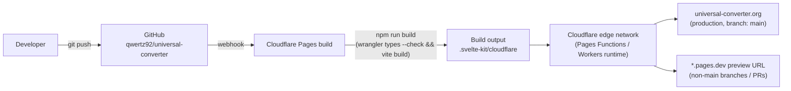

# Deployment — Cloudflare Pages

> Verified against this repo's actual configuration: `svelte.config.js` uses
> `@sveltejs/adapter-cloudflare` (targets Cloudflare Pages/Workers) with no
> custom adapter options; `wrangler.jsonc` sets
> `pages_build_output_dir: ".svelte-kit/cloudflare"` and
> `compatibility_date: "2026-07-04"`; `package.json`'s `build` script is
> `wrangler types --check && vite build`; the `preview` script is
> `wrangler pages dev .svelte-kit/cloudflare --port 4173`; there is a `gen`
> script (`wrangler types`) and no separate `deploy` script (path B below
> covers the equivalent CLI command directly). Since 0.2 the repo pins Node
> via `.nvmrc` (22) and an `engines` field (`>=20`) — Cloudflare Pages reads
> `.nvmrc` automatically; a dashboard `NODE_VERSION` environment variable
> (Path A, step 5) still works and takes precedence if set. Note: with
> `/api/convert` (0.2) the deployment is no longer purely static — the
> adapter emits a Pages Function for it, which the Git-integration build
> handles automatically.

## Deployment flow



There are two supported deployment paths. **Path A (dashboard Git
integration) is recommended** for this project — it gives automatic
production deploys on push, automatic preview deploys per branch/PR, and
needs no local Cloudflare credentials. Path B (CLI) is a manual alternative
useful for one-off deploys or environments without Git integration.

---

## Path A (recommended): Cloudflare dashboard, Git integration

This connects the GitHub repo directly to Cloudflare Pages so every push to
`main` deploys to production automatically, and every other branch/PR gets
its own preview URL.

### Step-by-step (for an operator with Cloudflare dashboard access)

1. **Go to the Cloudflare dashboard** → sign in → in the left sidebar click
   **Workers & Pages**.
2. Click **Create application** → the **Pages** tab → **Connect to Git**.
3. **Authorize Cloudflare's GitHub App** if not already done, then select the
   repository **`qwertz92/universal-converter`**. (If the repo isn't listed,
   the GitHub App needs to be granted access to it first — GitHub → Settings
   → Applications → Cloudflare Pages → Configure → add the repository.)
4. **Set up build settings:**
   - **Production branch:** `main`
   - **Framework preset:** you can select "SvelteKit" if offered, but verify
     the two fields below match exactly regardless — the preset is a
     starting point, not a guarantee:
   - **Build command:** `npm run build`
   - **Build output directory:** `.svelte-kit/cloudflare`
5. **Set the Node version** (no `.nvmrc`/`engines` field is committed to pin
   this automatically): under **Environment variables** (in the same setup
   flow, or later under **Settings → Environment variables**), add
   - `NODE_VERSION` = `20` (or a specific `20.x`/`22.x` version matching what
     the project is developed against — Node ≥ 20 is required per the
     README).
6. Click **Save and Deploy**. Cloudflare will clone the repo, run
   `npm install` then the build command, and deploy the output to a
   `*.pages.dev` URL. Watch the build log in the dashboard for the first
   deploy — this is where a wrong output-directory path or missing
   `NODE_VERSION` shows up immediately (a build error, not a silent bad
   deploy).
7. **Confirm automatic deploys are working:** after step 6, every future
   `git push` to `main` triggers a new production deployment, and pushing to
   any other branch (or opening a PR) triggers a **preview deployment** with
   its own unique `*.pages.dev` URL, visible in the Pages project's
   **Deployments** tab and (if the GitHub App has the permission) as a
   status check / comment on the PR itself.

### Custom domain: `universal-converter.org` + `www` redirect

8. In the Pages project, go to **Custom domains** → **Set up a custom
   domain** → enter `universal-converter.org`. If the domain's DNS is
   already on Cloudflare, this is a guided one-click flow (Cloudflare adds
   the necessary DNS record itself). If the domain is registered elsewhere,
   Cloudflare will show the DNS record (typically a `CNAME` or Cloudflare's
   own apex-handling record) to add at the current DNS provider — do that,
   then wait for verification (usually minutes, can take longer for DNS
   propagation).
9. Add `www.universal-converter.org` the same way (**Custom domains** → add
   again), then set up the redirect: either add both as custom domains and
   configure one as a **Bulk Redirect Rule** (Cloudflare dashboard →
   **Rules → Redirect Rules**) redirecting `www` → apex (or vice versa,
   per preference), or rely on Cloudflare's automatic `www`/apex handling if
   the domain's DNS is fully on Cloudflare (the guided custom-domain flow
   frequently offers this automatically — check the domain's **Rules**
   section after adding both).
10. **Verify HTTPS**: Cloudflare auto-provisions a TLS certificate for
    custom domains; check **SSL/TLS → Edge Certificates** shows the domain
    as active before considering the domain live.

---

## Path B: CLI deploy with Wrangler

Useful for a manual/one-off deploy, or from a machine without the GitHub
integration set up. Requires a Cloudflare account and either an interactive
login or an API token.

```bash
# One-time: authenticate the local wrangler CLI (opens a browser login flow)
npx wrangler login

# Build the app (regenerates Worker types, then builds via Vite)
npm run build

# Deploy the build output to Cloudflare Pages
npx wrangler pages deploy .svelte-kit/cloudflare --project-name=universal-converter
```

Notes:

- `npx wrangler login` requires an interactive browser session. In a
  non-interactive environment (CI, headless server), use an API token
  instead: set the `CLOUDFLARE_API_TOKEN` environment variable (created in
  the Cloudflare dashboard under **My Profile → API Tokens**, with the
  "Cloudflare Pages — Edit" permission) and Wrangler will pick it up
  automatically without an interactive login.
- The project name (`--project-name`) must match an existing Pages project,
  or Wrangler will offer to create one on first deploy.
- This path does **not** set up automatic deploys on push — it deploys
  exactly what's in your local working tree (built) at the moment you run
  the command. Prefer Path A for anything beyond a manual test deploy.

---

## No server-side secrets needed in v0.1

Everything in v0.1 is prerendered / statically generated (SSG) — the
conversion engine runs entirely client-side and at build time against the
committed `data/*.json` files. There are currently **no API keys, database
connections, or other secrets** required for the site to function, so no
Cloudflare **Environment Variables** beyond `NODE_VERSION` (build-time only,
not a secret) need to be configured. If a future phase adds server routes
(e.g. the roadmap's `/api/convert`) that need secrets, add them via
**Settings → Environment variables and secrets** in the Pages project, never
committed to the repo.

## Verifying a deploy

After any deploy (automatic or manual), spot-check:

- The deployment's own preview/production URL loads (shown in the
  **Deployments** tab, or printed by `wrangler pages deploy`).
- The root page (`/`) renders without a build-time or runtime error —
  check the **Functions** / **Real-time Logs** tab in the dashboard if
  something looks broken (`wrangler pages deployment tail` from the CLI does
  the same thing).
- Once the custom domain is attached: `https://universal-converter.org/`
  and `https://www.universal-converter.org/` both resolve and redirect as
  configured.
- A couple of representative interactive routes (once the Frontend agent's
  routes exist — `/convert`, a `/units/[unit]` page, `/sources`) render
  correctly, not just the static landing page.

## Rollbacks

Cloudflare Pages keeps every previous deployment. To roll back:

1. **Workers & Pages → (this project) → Deployments.**
2. Find the last known-good deployment in the list.
3. Click the **"..."** menu on that deployment → **Rollback to this
   deployment** (or **Retry deployment**, depending on Cloudflare's current
   UI wording — look for the option that promotes a prior build to
   production without needing a new git push).
4. Confirm the production URL now serves the rolled-back build.

Because deploys are immutable and listed with their triggering commit,
rollback is a dashboard click, not a `git revert` + rebuild — use the
dashboard rollback for a fast recovery, and follow up with the actual `git
revert`/fix on `main` so the next automatic deploy doesn't reintroduce the
issue.

---

## Handover checklist (for an operator with Cloudflare dashboard access)

Work through top to bottom; each step names what to verify before moving on.

- [ ] **Connect the repo.** Workers & Pages → Create application → Pages →
      Connect to Git → `qwertz92/universal-converter`. Verify: the
      Cloudflare GitHub App shows the repo as accessible (grant access at
      the GitHub App's config page if it's missing from the list).
- [ ] **Set build settings.** Build command `npm run build`; build output
      directory `.svelte-kit/cloudflare`; production branch `main`. Verify:
      the first build's log shows `wrangler types --check` and `vite build`
      both running, and ends with a successful deploy, not a red error.
- [ ] **Pin the Node version.** Add environment variable `NODE_VERSION=20`
      (or the exact version in local use). Verify: re-check the build log —
      it should print the pinned version near the top, not a Cloudflare
      default that might differ from what's tested locally.
- [ ] **Confirm automatic deploys.** Push a trivial commit to `main` (or
      merge a PR) and confirm a new production deployment appears in the
      **Deployments** tab within a minute or two of the push, without any
      manual action.
- [ ] **Confirm preview deploys.** Push a branch or open a PR and confirm a
      distinct `*.pages.dev` preview URL is generated and (if permissions
      allow) posted back to the PR.
- [ ] **Attach the custom domain.** Custom domains → add
      `universal-converter.org`, then `www.universal-converter.org`.
      Verify: both show as **Active** under SSL/TLS → Edge Certificates,
      and both resolve over HTTPS in a browser.
- [ ] **Set the www/apex redirect** so visitors land on one canonical host.
      Verify: visiting the non-canonical host redirects (not just
      resolves) to the canonical one.
- [ ] **Spot-check the live site** per "Verifying a deploy" above.
- [ ] **Note who has dashboard access** and how API tokens (if any, for
      Path B/CI use) are stored — this project has no secrets in v0.1, but
      that will change once phase 0.2+ features (e.g. `/api/convert`) land.

---

## Cross-references

- Tech-stack rationale: `docs/adr/0001-tech-stack.md`.
- Why Cloudflare Pages (vs. the alternative of self-hosting on the existing
  VPS): `docs/adr/0004-cloudflare-deployment.md`.
- Architecture / build-time data flow: `docs/architecture.md`.
